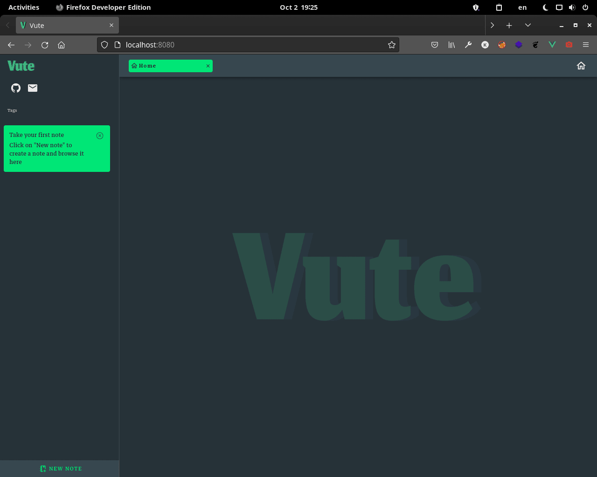
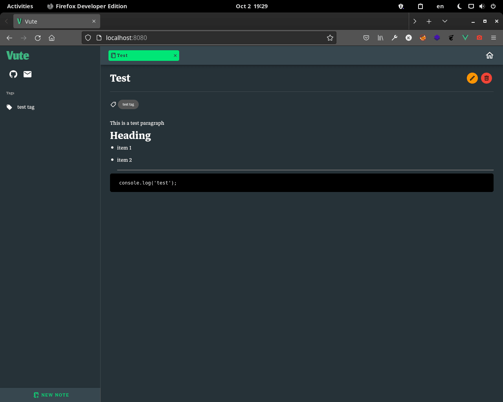
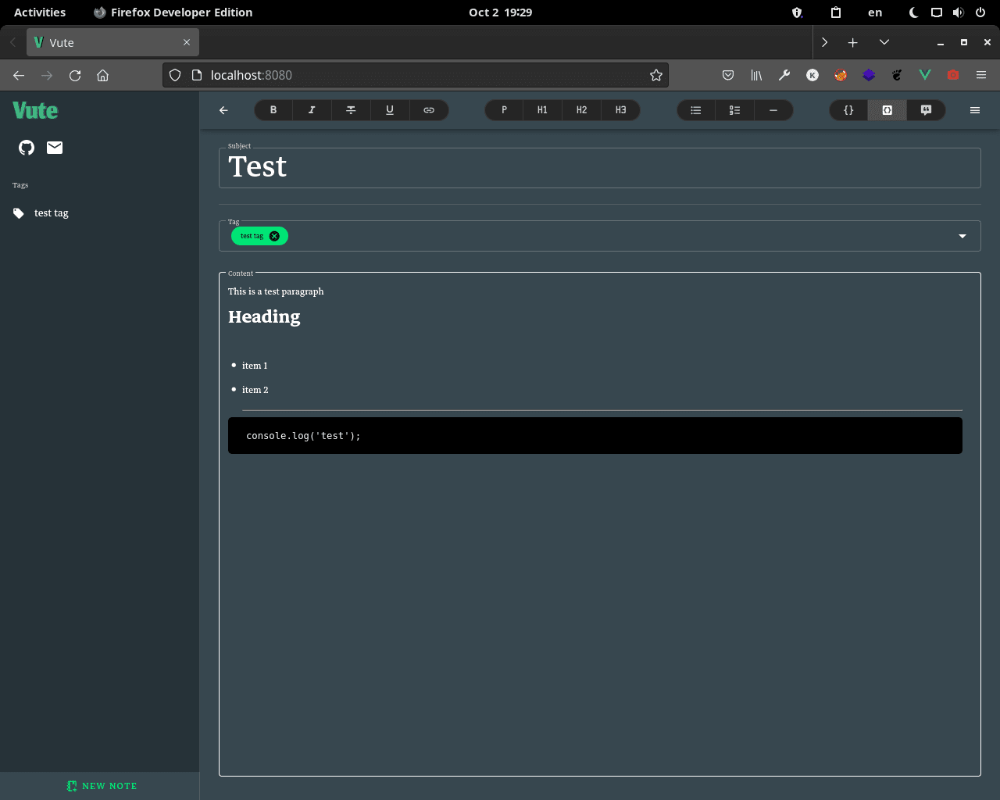

---

Vute is an app designed for note taking.

## Screenshots

## Install

1. You can install the latest version [here](https://github.com/KhashayarKhm/vute/releases/latest)
2. Extract the zipped file
3. Run the `index.html` in your browser

---

 
     

